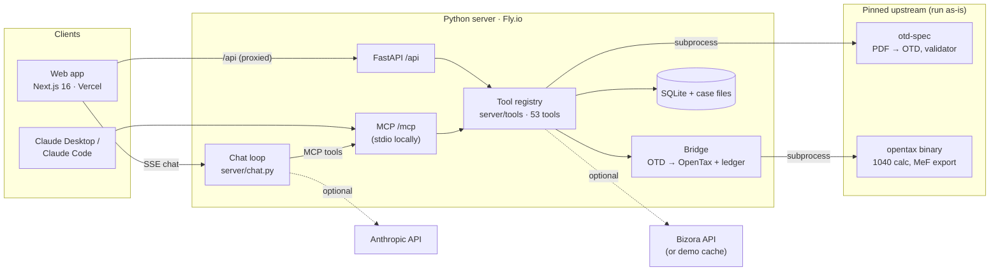

# Drivkraft Tax

**A Schedule K-1 from PDF to a Form 1040, with every number traced back to its source.**

A practice build on the Open Tax Technology Alliance's open code: the [OTD](https://github.com/opentaxdocument/otd-spec) K-1 data standard and the [OpenTax](https://github.com/filedcom/opentax) 1040 engine. One MCP server holds every capability, so Claude Desktop, Claude Code and the web app share the same tools.

> **Synthetic data only.** Every client, K-1 and figure is made up. It isn't tax advice, and nothing is ever sent to the IRS. This is an independent project, not affiliated with or endorsed by Filed, Crimson Tree Software or Bizora.

**Live demo:** [drivkraft-tax-ix69-kuvmdn874-michael-renwick-s-projects.vercel.app](https://drivkraft-tax-ix69-kuvmdn874-michael-renwick-s-projects.vercel.app) · **Case study:** [build log](https://claude.ai/artifact/HR6Jmik1tiGXsUkN9rfxhh) · **2-minute video:** _link_

## What it does

| | |
|---|---|
| **K-1 intake and review** | A 27-page synthetic K-1 package runs through the upstream PDF → OTD pipeline with named stages. The review screen shows each box beside the region of the PDF it came from. Edits keep the original and need a reason, and approval is blocked until every flag is acknowledged. Keyboard-first (`j`/`k`, `n`, `e`, `a`, `⌘↵`). |
| **The bridge** | Translates OTD to OpenTax inputs with a disposition ledger for every node (mapped, collapsed, derived, unsupported, informational). It refuses invalid OTD, keeps null ≠ 0, and flags anything the engine accepts but never uses. |
| **Return** | OpenTax calculates the 1040. Click any line to see a leave-one-out waterfall of the K-1 boxes and inputs behind it. What-if scenarios compare side by side. |
| **Chat** | Claude over the same MCP tools, with visible tool steps and citation chips that open the K-1 box or 1040 line. Chat can propose an edit but never make one; proposals wait in the Inbox. |
| **Notes and research** | Meeting transcripts become proposals (document requests, scenarios, research questions, a follow-up draft). Tax research via Bizora comes with numbered citations to primary authority. |
| **Outputs** | An Excel workpaper round-trip: export, edit the yellow cells, re-import, then review a cell-level diff before anything applies. Also a PDF review packet. |
| **E-file dry run** | OpenTax builds MeF XML and checks it against the business rules. A fake transmitter plays the IRS e-File database (name control, prior-year AGI), with rejects that link to the field to fix. |
| **Operator page** | Tool latency (p50/p95), estimated AI and Bizora spend, bridge gaps by box, e-file rejects, upstream pins and the smoke test results. |

## How it fits together



Every capability is a plain function registered once in `server/tools/`. `server/app.py` exposes each one twice, as an MCP tool and as a FastAPI route, so the UI never holds logic that Claude can't reach. Every response carries `sources[]`, the refs the chat cites.

## What I found: where OTD and OpenTax don't meet

The bridge's ledger makes these visible on every K-1. Details are in [`planning/03-otd-to-opentax-mapping.md`](planning/03-otd-to-opentax-mapping.md).

- **Accepted isn't used.** OpenTax 2.0.4 accepts Box 4c, 13, 18 and 19 but never routes them into the calculation. Box 16 only routes with K-3 fields, and 20 UBIA/SSTB never reach Form 8995. The bridge flags each as `calculation_incomplete`, and approval needs a reviewer to acknowledge it.
- **Unknown fields are stripped silently.** `partnership_ein`, which every upstream benchmark uses, is accepted and dropped. The bridge reads the engine's own schema (`opentax node inspect`) at runtime and refuses anything else.
- **Zero is treated as missing.** A K-1 with 14A = 0 still gets SE tax on 4a, and Box 1 counts as passive whenever 14A is absent *or* zero.
- **A 28% gain zeroes the tax.** Any Box 9b amount makes two nodes both send `rate_28_gain`. Income tax then comes out $0, with only a warning. The bridge holds 9b back and reports engine node failures as caveats.
- **Box 13 needed a detour.** Codes A–G go to Schedule A and H to line 9, the way upstream benchmarks do it by hand. The bridge emits several forms per K-1.
- **MeF export gaps.** The prior-year AGI is never written to the header, so a self-select PIN can't be verified. `return validate` also checks rules for forms the return doesn't contain. IND-082 fails every balance-due return, and Schedule A is emitted even when the standard deduction wins.

Two things get you most of the way when mapping between these standards: a ledger that accounts for every node, and a refusal to drop anything silently.

## Run it locally

Needs git, curl, [uv](https://docs.astral.sh/uv/) and Node 20+. macOS or Linux.

```bash
git clone <this repo> drivkraft-tax && cd drivkraft-tax
scripts/bootstrap.sh            # pinned otd-spec + opentax v2.0.4 binary + Python 3.11 venv
scripts/smoke.sh                # 5 checks against the upstream code
uv run drivkraft-tax-server     # http://127.0.0.1:8787  (/api, /api/docs, /mcp)
cd web && npm install && npm run dev    # http://localhost:3000
```

Keys are optional. Copy `.env.example` to `.env` and add `ANTHROPIC_API_KEY` for chat and meeting analysis, or `BIZORA_API_KEY` for live research. Without them those panels say "not configured" and everything else works. Cached research questions and the sample meeting analysis need no key.

Tests: `.venv/bin/python -m pytest server/tests`.

## Use it from Claude

**Local (stdio)**, in Claude Desktop's `claude_desktop_config.json`:

```json
{ "mcpServers": { "drivkraft-tax": { "command": "/path/to/drivkraft-tax/.venv/bin/drivkraft-tax-mcp" } } }
```

Claude Code: `claude mcp add drivkraft-tax -- /path/to/drivkraft-tax/.venv/bin/drivkraft-tax-mcp`

**Hosted demo** (needs an invite code, sent as a bearer token):

```bash
claude mcp add --transport http drivkraft-tax https://<server-host>/mcp --header "Authorization: Bearer <invite code>"
```

For Claude Desktop, bridge the remote server with `mcp-remote`:

```json
{ "mcpServers": { "drivkraft-tax": { "command": "npx", "args": [
  "mcp-remote", "https://<server-host>/mcp", "--header", "Authorization: Bearer <invite code>" ] } } }
```

Then try: *"List my cases, then tell me what on the Copperleaf K-1 isn't in the calculation."* Remote MCP clients share one sandbox.

## The hosted demo

The server runs with `DRIVKRAFT_DEMO=1` (`server/sandbox.py`):

- **A sandbox per visitor.** Each browser gets a cookie and its own copy of three cases: Rivera (the Copperleaf K-1 approved, with a planning call to analyze), Chen (a simple W-2 + K-1 return) and Okafor (an e-file already rejected for a prior-year AGI mismatch). The reference cases are shared and read-only. A few sandboxes are seeded ahead of time, so a first visit is instant.
- **Guardrails.** Per-visitor rate limits on writes, intakes, chat turns and meeting analyses, plus a per-IP limit on new sandboxes. A monthly cap on estimated Anthropic spend: after that, visitors can paste their own key, which stays in the browser tab. Research answers come from a cache unless you have the invite code, which also guards `/mcp`.
- **Nightly reset** at 08:00 UTC. "Reset my sandbox" resets only yours.
- **Intake** accepts only the bundled synthetic samples.

Deploy: see [`docs/deploy.md`](docs/deploy.md).

## Credits

- [OpenTax](https://github.com/filedcom/opentax) by Filed Inc.: AGPL v3, run unmodified as a subprocess, pinned at v2.0.4.
- [Open Tax Document (OTD)](https://github.com/opentaxdocument/otd-spec) by Tom O'Sullivan, Crimson Tree Software: CC BY 4.0.
- [Bizora](https://www.bizora.ai): tax research API.
- Visual design borrows from the Drivkraft platform (slate/blue Tailwind); fonts are Geist (OFL).
